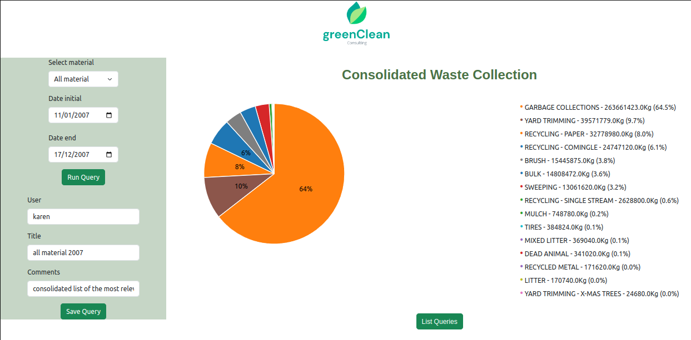
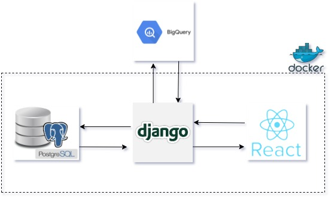

# greenClean

greenClean is in an application which graphically displays the requested results through a graphical interface using selection fields, the data is extracted from the bigquery database.

# how does it work

- A user guide is provided where the operation is explained in detail and graphically [userguide click here](./USERGUIDE)

# architecture

basic architecture used for the development of the project

# application functions

- Visual Summary of Queried Data
- Save Query With Name, Username, and Comment

* Show All Saved Queries
* Comment on Query
* Select Saved Query
* Persistence
* Multiplayer Functionality

| Files and Folders                                                                 | Details                                                            |
| --------------------------------------------------------------------------------- | ------------------------------------------------------------------ |
| [userguide](./USERGUIDE)                                                          | how the application works                                          |
| [consultant](./consultant)                                                        | contains all frontend directories and files                        |
| [consultant_back](./consultant_back)                                              | containts all backend directories and files                        |
| [apis](./consultant_back/reports/apis/)                                           | endpoints                                                          |
| [connection_bigquery](./consultant_back/reports/connection_biquery/connection.py) | function that makes the connection to the google bigquery database |
| [queries](./consultant_back/reports/queries/query_bigquery.py)                    | sql sentences to obtain the data necesary for the graph            |
| [utils](./consultant/src/utils/)                                                  | functions that provide communication with the server               |

# tools

- react
- d3.js
- django
- django rest framework
- postgres
- docker compose

## Installation

- Clone this repository: `https://github.com/ruizdani301/greenclean"`
- Access greenclean directory: `cd greenclean`
- Run docker compose: `docker compose up --build` and enter command

* frontend expose port 9000
* backend expose port 8000

## Authors

Daniel Ruiz - [Github](https://github.com/ruizdani301) - [linkedin](https://www.linkedin.com/in/daniel-ruiz)
