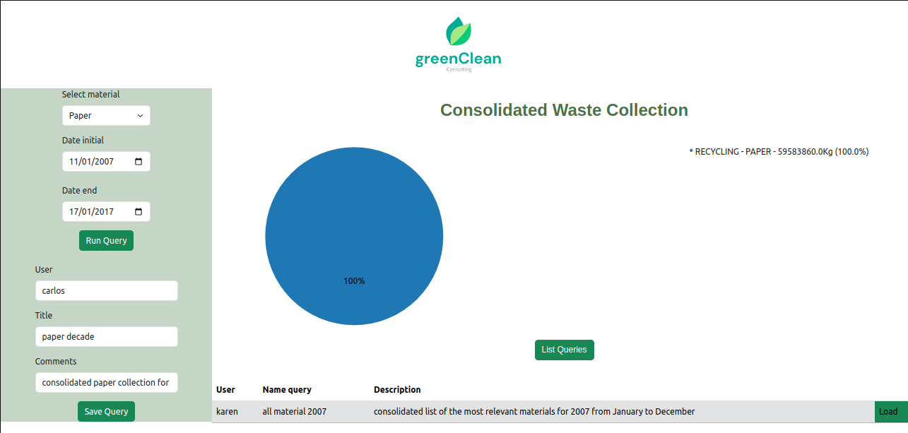

# greenClean consulting

greenClean, is a consulting company in charge of measuring the waste collected in the city of Austin, Texas, with the objective of obtaining relevant information for making decisions that improve the quality of life of the environment.

Now we will show the sections of the application and how it works.

Now that we know 2 important sections of the application, we will request the consolidation in kilograms of all the waste collected in 2007, for this we will select all the materials, the date initial and the date end for a more precise calculation and at the end, we must click on Run Query, this will result in a graph with the most relevant percentages, as well as a list that details the information with the amount of waste in kilograms.

## Save information

Just as we were able to consult, we can also save the query data, the user who made the query and the comment that details the query made.

## list saved queries

Now, all this seems very good, but now how can we see the saved queries? Simply by clicking on List you will be able to see the name of the query, the description and the user who created it

Now what would happen if I wanted to reload the saved information? Let's see the case that another user in this case Carlos makes a query of the number of kilograms of paper collected between 2007 and 2017 and saves it.

Carlo's record would be here

## retrieve a saved query

But now we want to see the query saved by karen. In this case we just click on the **load** button, and it will bring back all of Karen's consultation data and when we click on **Run Query** we will have the graph and the list of details of the consultation again.

